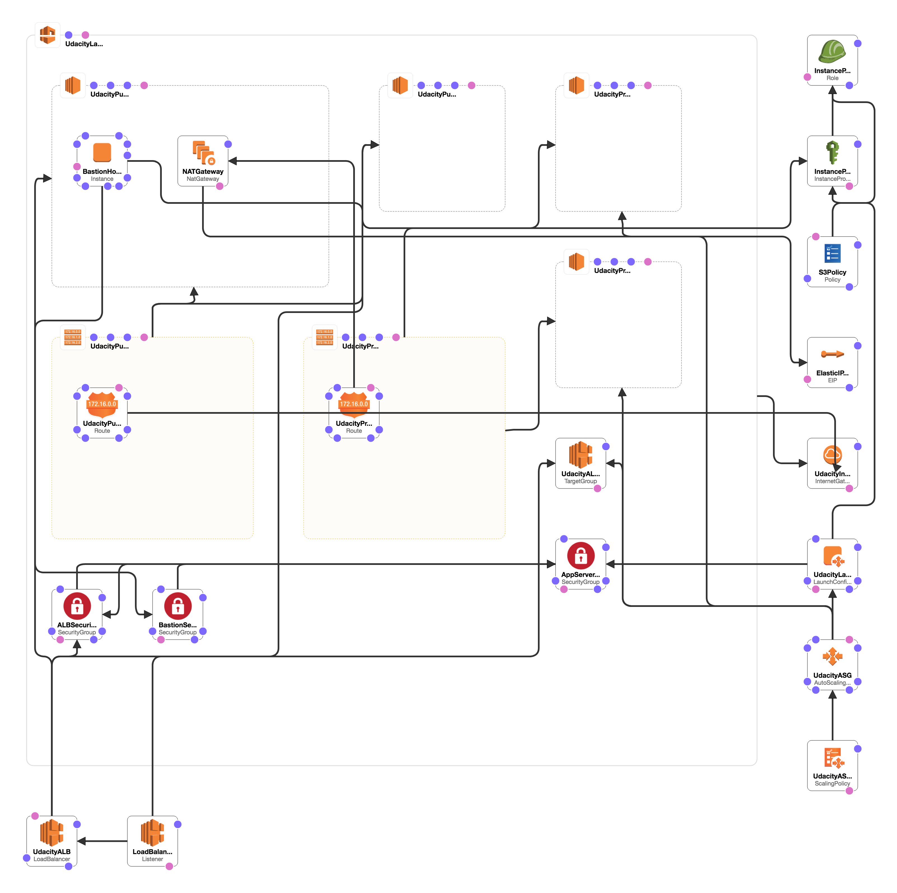

##Udacity - Udagram (CloudFormation Template Project)  

In this project, you’ll deploy web servers for a highly available web app using CloudFormation. You will write the code that creates and deploys the infrastructure and application for Instagram-like app from the ground up. You will begin with deploying the networking components followed by servers, security roles and software. The procedure you follow here will become part of your portfolio of cloud projects. You’ll do it exactly as it’s done on the job - following best practices and scripting as much as possible.

- **Server Specs**  
You'll need to create a Launch Configuration for your application servers in order to deploy four servers, two located in each of your private subnets. The launch configuration will be used by an auto-scaling group.  
You'll need two vCPUs and at least 4GB of RAM. The Operating System to be used is Ubuntu 18. So, choose an Instance size and Machine Image (AMI) that best fits this spec. Be sure to allocate at least 10GB of disk space so that you don't run into issues. 

## Reference architecture 

## Parameters
  - **VPCCIDR:** CIDR for your vpc
    
  - **PublicSunbet1:** CIDR for your public subnet 1
   
  - **PublicSunbet2:** CIDR for your public subnet 2
 
  - **PrivateSubnet1:** CIDR for your private subnet 1
   
  - **PrivateSubnet2:** CIDR for your private subnet 1
    
  - **s3bucket:** s3 bucket which has your code
    
  - **s3ReadWritePolicyName:** iam policy which has permission to read and write to s3 bucket
   
  - **InstanceRoleName:** iam role name which s3ReadWritePolicyName policy attached to it
   
## Creates following resources

- VPC
    - 2 public subnets
    - 2 private subnets
    - Internet gateway (igw)
    - NAT gateway in public subnet (nat)
    - Elastic IP for NAT gateway
    - Public Route table - attached igw, and associate 2 public subnets
    - Private Route table  - attached nat gateway, associate 2 private subnets
    
- Instance role
    - s3 read write policy
    - instance role
    - instance profile
 
- Security Groups (sg)
    - Bastion security group (ssh access)
    - App Server (ssh access from bastion-sg, and http request from load balancer)
    - load balancer (http from world, http from app-server-sg)

- Launch Configuration
    - ec2 instances 
        - os: ubuntu 18.04
        - type: t2.medium (2 CPUs, 4 GB Mem)
        - SSD: 10 GB
        - Security Group: App Server
        - Key piar: udacity
        - Instance profile with access to s3
        - UserData to
            - install httpd
            - install aws cli
            - copy files from s3 to /var/www/html
        

- AutoScalingGroup
    - Min size: 4
    - Max size: 8
    - Subnets: 2 private subnets each in different AZ

- Elastic Loadbalancer 

- BastionHost in public subnet

#### Review changes:

- added parameters for vpc and subnet cidrs 
- added output section        

#### To-do :
- How to I create alias record in route53 and point it to my load balancers DNS name?

## URL: 
**Please refer to the output section of cloudformation** 

## My Deployment URL
**http://udagram-alb-1284067575.us-east-1.elb.amazonaws.com/**

### Notes 
- You can ssh into bastion host and then ssh into your app servers 